# CollabSphere - Production-Grade Authentication Flow

CollabSphere is a MERN stack collaboration application. This document details the production-grade, secure authentication architecture built using Express, MongoDB, React, Zustand, and TanStack Query.

---

## 1. Authentication Architecture & Lifecycle

CollabSphere uses a hybrid **Cookie + Bearer JWT** authentication strategy with automatic, silent token rotation:
- **Short-Lived Access Tokens (JWT)**: Valid for 15 minutes, used to authorize API endpoints. Sent in cookies (HTTP-only) or read from headers.
- **Long-Lived Refresh Tokens (JWT)**: Valid for 7 days, stored securely in database under User model and in HTTP-only cookies. Used to silently request new access tokens when they expire.

### Authentication Flow Diagram

```mermaid
sequenceDiagram
    autonumber
    actor User
    participant Frontend as React Client
    participant Interceptor as Axios Interceptor
    participant Backend as Express Server
    participant DB as MongoDB

    %% Registration / Login
    User->>Frontend: Enter credentials
    Frontend->>Backend: POST /api/v1/auth/login
    Backend->>DB: Verify user & bcrypt compare password
    DB-->>Backend: User details
    Backend->>Backend: Generate Access & Refresh JWTs
    Backend->>DB: Save Refresh Token to User document
    Backend-->>Frontend: Set HttpOnly Cookies (accessToken, refreshToken) + JSON profile
    Frontend->>Frontend: Store user profile in Zustand

    %% Normal API Call
    Frontend->>Interceptor: Call API /api/v1/workspaces
    Interceptor->>Backend: Pass request (automatic cookies)
    Backend-->>Frontend: 200 OK (data payload)

    %% Access Token Expiration & Silent Refresh
    Frontend->>Interceptor: Call API /api/v1/tasks
    Interceptor->>Backend: Request sent (expired accessToken)
    Backend-->>Interceptor: 401 Unauthorized (Expired Token)
    
    rect rgb(30, 27, 46)
        note right of Interceptor: Interceptor catches 401 error, pauses queue
        Interceptor->>Backend: POST /api/v1/auth/refresh (sends refreshToken cookie)
        Backend->>DB: Validate incoming refreshToken matches stored token
        Backend->>Backend: Generate new Access & Refresh JWTs
        Backend->>DB: Update stored Refresh Token
        Backend-->>Interceptor: 200 OK (sets new Cookies)
    end
    
    Interceptor->>Backend: Retry original API /api/v1/tasks (success)
    Backend-->>Frontend: 200 OK (tasks data)
```



---

## 2. Backend Auth Engine

The backend API is located in the `backend` folder and manages users, database sessions, and middleware checks.

### Endpoint Specifications

| Method | Endpoint | Auth Required | Description |
| :--- | :--- | :---: | :--- |
| **POST** | `/api/v1/auth/register` | No | Registers new user, hashes password via bcrypt, logs them in by setting cookies. |
| **POST** | `/api/v1/auth/login` | No | Validates credentials, sets accessToken/refreshToken cookies, and returns the profile details. |
| **POST** | `/api/v1/auth/logout` | Yes | Invalidates the refresh token in MongoDB and clears cookies. |
| **POST** | `/api/v1/auth/refresh` | No | Verifies the refresh token cookie, rotates access and refresh tokens, sets new cookies. |
| **GET** | `/api/v1/auth/me` | Yes | Returns details of the currently logged-in user retrieved from the JWT payload. |
| **PUT** | `/api/v1/auth/change-password` | Yes | Validates the current password and updates it in the database. |

### Core Files
- **Routes**: [auth.routes.js](file:///c:/pratik%20-%20Copy/chaireact/fullstack/CollabSphere/backend/src/modules/auth/auth.routes.js)
- **Controller**: [auth.controller.js](file:///c:/pratik%20-%20Copy/chaireact/fullstack/CollabSphere/backend/src/modules/auth/auth.controller.js)
- **Service Layer**: [auth.service.js](file:///c:/pratik%20-%20Copy/chaireact/fullstack/CollabSphere/backend/src/modules/auth/auth.service.js)
- **Database Model**: [User.js](file:///c:/pratik%20-%20Copy/chaireact/fullstack/CollabSphere/backend/src/models/User.js)
- **JWT Verification**: [auth.middleware.js](file:///c:/pratik%20-%20Copy/chaireact/fullstack/CollabSphere/backend/src/modules/auth/auth.middleware.js)

---

## 3. Frontend Auth Architecture

The React application implements state-of-the-art Client architecture using **Zustand** for state, **TanStack Query** for mutations/fetching, and **Axios Interceptors** for silent token refreshes.

### Key Components

1. **Vite Development Proxy** ([vite.config.js](file:///c:/pratik%20-%20Copy/chaireact/fullstack/CollabSphere/frontend/vite.config.js)):
   Maps local server requests under `/api` to target `http://localhost:3000`. This maps the MERN backend cleanly and prevents CORS issues:
   ```javascript
   server: {
     proxy: {
       '/api': {
         target: 'http://localhost:3000',
         changeOrigin: true
       }
     }
   }
   ```

2. **Silent Refresh Interceptor** ([axios.js](file:///c:/pratik%20-%20Copy/chaireact/fullstack/CollabSphere/frontend/src/api/axios.js)):
   Intercepts `401 Unauthorized` responses. If multiple concurrent requests fail due to token expiration, only *one* refresh token request is sent. Remaining requests are queued and re-fired once a new access token is established. If the refresh request itself fails (e.g. refresh token expired), the local session is cleared, logging out the user.

3. **Global State Store** ([auth.store.js](file:///c:/pratik%20-%20Copy/chaireact/fullstack/CollabSphere/frontend/src/store/auth.store.js)):
   Maintains `user`, `isAuthenticated`, and `isAuthLoading` states. Exposes `checkAuth()` which checks for an active session with `/auth/me` on startup:
   ```javascript
   checkAuth: async () => {
     set({ isAuthLoading: true });
     try {
       const res = await getCurrentUser();
       set({ user: res.data, isAuthenticated: true, isAuthLoading: false });
     } catch (e) {
       set({ user: null, isAuthenticated: false, isAuthLoading: false });
     }
   }
   ```

4. **Navigation Route Guards**:
   - [ProtectedRoute.jsx](file:///c:/pratik%20-%20Copy/chaireact/fullstack/CollabSphere/frontend/src/routes/ProtectedRoute.jsx): Enforces session verification for private routes. Shows a sleek glowing progress spinner while verifying session.
   - [PublicRoute.jsx](file:///c:/pratik%20-%20Copy/chaireact/fullstack/CollabSphere/frontend/src/routes/PublicRoute.jsx): Redirects authenticated users away from `/login` or `/register` to `/dashboard`.

5. **Sleek, Responsive UI Layouts**:
   - **Split Screen Auth Layout** ([AuthLayout.jsx](file:///c:/pratik%20-%20Copy/chaireact/fullstack/CollabSphere/frontend/src/components/layout/AuthLayout.jsx)): A premium dual-pane visual design. Includes an interactive mock workspace card detailing active boards.
   - **Dashboard App Shell** ([AppLayout.jsx](file:///c:/pratik%20-%20Copy/chaireact/fullstack/CollabSphere/frontend/src/components/layout/AppLayout.jsx)): A left-sidebar container displaying user identity (avatar, name, email) and a quick-action logout button.
   - **Diagnostic Session Monitor** ([DashboardPage.jsx](file:///c:/pratik%20-%20Copy/chaireact/fullstack/CollabSphere/frontend/src/pages/DashboardPage.jsx)): Contains diagnostic buttons to test manual token refreshes and verify authorized queries with a live log console.

---

## 4. Local Development Setup

Follow these steps to spin up the MERN project locally:

### Prerequisites
- Node.js installed
- MongoDB instance running locally or on MongoDB Atlas (already configured in `.env`)

### Step 1: Start the Backend Server
1. Navigate to the backend directory:
   ```bash
   cd CollabSphere/backend
   ```
2. Install backend dependencies:
   ```bash
   npm install
   ```
3. Run the development server (runs on port 3000):
   ```bash
   npm run dev
   ```

### Step 2: Start the React Frontend
1. Navigate to the frontend directory:
   ```bash
   cd CollabSphere/frontend
   ```
2. Install frontend dependencies:
   ```bash
   npm install
   ```
3. Run the development server (runs on port 5173):
   ```bash
   npm run dev
   ```
4. Open your browser to `http://localhost:5173`.
