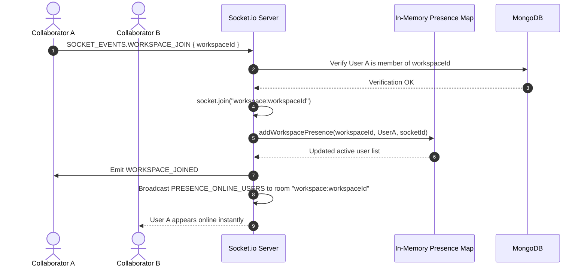

# CollabSphere 🌐

[](https://nodejs.org/)
[](https://react.dev/)
[](https://expressjs.com/)
[](https://tailwindcss.com/)
[](https://opensource.org/licenses/ISC)

CollabSphere is a production-grade, full-stack team collaboration platform designed on a micro-architectural MERN pattern. Far beyond a simple todo list, CollabSphere models modern project management software (like Trello and Slack) with a real-time event synchronization engine, secure hybrid session storage with token rotation, and highly optimized database querying.

---

## 🚀 Key Engineering Pillars

This project was built to demonstrate enterprise-level patterns in full-stack JavaScript. Below are the core engineering problems solved in this codebase:

### 1. Silent Token Rotation & Concurrency Queueing
*   **The Problem:** Traditional single JWT flows either force users to re-login frequently (short expiry) or expose critical security risks (long expiry). When using separate access and refresh tokens, concurrent dashboard requests that hit expired access tokens trigger simultaneous refresh requests, causing race conditions and database locks.
*   **The Solution:** A dual-token architecture utilizing **HTTP-Only, Secure, SameSite=Lax cookies**. 
    *   **Access Token:** 15-minute lifespan.
    *   **Refresh Token:** 7-day lifespan, stored hashed in MongoDB and verified only when rotating the session.
    *   **Axios Interceptor Queueing:** If a client request returns `401 Unauthorized` (access token expired), the Axios interceptor pauses the application's outbound request queue, initiates a single `/auth/refresh` request, updates the cookie session, and replays all queued requests seamlessly.
    *   **Transient Error Retry:** Integrates automatic retry hooks for transient status errors (502, 503, 504) using an **Exponential Backoff** delay to survive brief server resets or network blips.

### 2. In-Memory Socket.io Presence Engine
*   **The Problem:** Storing active online states directly in MongoDB causes high write-amplification and database throttling.
*   **The Solution:** A high-speed, volatile presence engine utilizing native ES6 `Map` and `Set` structures on the Express server:
    *   Maintains O(1) socket-to-user maps (`userSockets`), workspace-to-active-users maps (`workspacePresence`), and socket-to-workspaces maps (`socketWorkspaces`).
    *   Enforces strict room boundaries (`workspace:workspaceId`). When a user joins a workspace, they subscribe to a Socket.io room and trigger a presence broadcast.
    *   Graceful cleanup handlers automatically remove the socket from all associated rooms and maps upon disconnect, preventing memory leaks.

### 3. Stream-Based Cloud Attachments (Zero Disk Writes)
*   **The Problem:** Standard file uploads save files to server local storage before uploading to a Cloud CDN. This breaks on serverless or ephemeral container deployments (like AWS Fargate or Heroku) where disk drives are read-only or reset on scale.
*   **The Solution:** Multer is configured to use memory storage buffers (`multer.memoryStorage()`). The file payload is piped directly into a Cloudinary write stream (`cloudinary.uploader.upload_stream`) wrapping it in a Promise. The backend never writes a single byte to the server's local disk, optimizing I/O speed and ensuring container compliance.

### 4. Interactive Kanban Engine with `@dnd-kit`
*   **The Problem:** Clunky state updates when moving items between lists, causing layout layout shifts and poor responsiveness.
*   **The Solution:** Implementation of a modern drag-and-drop layout using `@dnd-kit` (Sortable Contexts). Supports dragging tasks across vertical Kanban columns representing project boards. UI mutations utilize TanStack Query's **Optimistic UI Updates** to instantly move tasks visually before confirming database updates over API requests.

---

## 📐 System Architecture

### 1. Authentication & Token Rotation Lifecycle

```mermaid
sequenceDiagram
    autonumber
    actor User as Client UI
    participant Interceptor as Axios Network Layer
    participant Backend as Express Auth Module
    participant DB as MongoDB

    %% User Signs In
    User->>Interceptor: Submit credentials
    Interceptor->>Backend: POST /api/v1/auth/login
    Backend->>DB: Verify email & bcrypt compare password
    DB-->>Backend: User Document
    Backend->>Backend: Generate Access (15m) & Refresh (7d) JWTs
    Backend->>DB: Store hashed Refresh Token
    Backend-->>Interceptor: Set HTTP-Only cookies (accessToken, refreshToken)
    Interceptor-->>User: Populate Zustand Auth Store

    %% Access Token Expiry Catch
    User->>Interceptor: Request boards list
    Interceptor->>Backend: GET /api/v1/boards (expired token)
    Backend-->>Interceptor: 401 Unauthorized (TOKEN_EXPIRED)
    
    rect rgb(24, 24, 37)
        note right of Interceptor: Interceptor intercepts 401, pauses outgoing queue
        Interceptor->>Backend: POST /api/v1/auth/refresh
        Backend->>DB: Verify incoming refresh token against database
        Backend->>Backend: Generate new Access & Refresh JWTs
        Backend->>DB: Update stored Refresh Token (Rotation)
        Backend-->>Interceptor: Set new HTTP-Only cookies
    end
    
    Interceptor->>Backend: Retry paused request: GET /api/v1/boards
    Backend-->>User: 200 OK (Render boards list)
```



### 2. Real-Time Workspace Presence & Room Broadcasts



---

## 🗄️ Database Schema & Indexing Model

The database uses MongoDB managed by Mongoose. In order to optimize read speeds and ensure relational integrity, compound index schemas have been configured.

```
                  ┌───────────────────────┐
                  │         User          │
                  │  - email (Indexed)    │
                  │  - name               │
                  │  - avatarUrl          │
                  └──────────┬────────────┘
                             │ (1:N Owner / Member)
                             ▼
                  ┌───────────────────────┐
                  │       Workspace       │
                  │  - slug (Indexed)     │
                  │  - owner (Indexed)    │
                  │  - members [ {user} ] │◀────────────┐
                  └──────────┬────────────┘             │
                             │ (1:N Boards)             │ (1:N Assignee)
                             ▼                          │
                  ┌───────────────────────┐             │
                  │         Board         │             │
                  │  - workspace (Indexed)│             │
                  │  - title              │             │
                  └──────────┬────────────┘             │
                             │ (1:N Tasks)              │
                             ▼                          │
                  ┌───────────────────────┐             │
                  │         Task          │             │
                  │  - board (Indexed)    │             │
                  │  - workspace (Indexed)│             │
                  │  - assignee ────────────────────────┘
                  │  - attachments [ ]    │
                  └───────────────────────┘
```

### Key Indexed Queries
*   **Workspace Member Lookups:** `workspaceSchema.index({ "members.user": 1 })` allows instantaneous checking of user memberships during API requests and socket handshakes.
*   **Kanban Board Ordering:** `boardSchema.index({ workspace: 1, position: 1 })` ensures quick sorting of board columns when rendering a workspace dashboard.
*   **Task Lookups:** `taskSchema.index({ workspace: 1, board: 1 })` and status/due date indices optimize heavy filtering queries.

---

## 📡 API Contract Specification

All endpoints return a standardized JSON envelope wrapped via an `ApiResponse` class, ensuring consistent client parsing:
```json
{
  "statusCode": 200,
  "success": true,
  "message": "Operation description",
  "data": { ... }
}
```

### 1. Authentication Endpoints (`/api/v1/auth`)

| Method | Endpoint | Authorization | Description |
| :--- | :--- | :---: | :--- |
| **POST** | `/register` | Public | Register new user, hashes password, saves session cookies. |
| **POST** | `/login` | Public | Validate email/password credentials, set cookies. |
| **POST** | `/logout` | Private | Invalidate refresh token in DB, clear response cookies. |
| **POST** | `/refresh` | Public | Read refresh cookie, rotate tokens, issue new cookie pair. |
| **GET** | `/me` | Private | Retrieve active user profile data. |
| **PUT** | `/change-password` | Private | Change password with old/new validation check. |

### 2. Workspaces, Boards & Tasks Endpoints

| Module | Method | Endpoint | Auth | Description |
| :--- | :--- | :--- | :---: | :--- |
| **Workspaces** | **POST** | `/api/v1/workspaces` | Private | Create a new team workspace |
| | **GET** | `/api/v1/workspaces` | Private | Fetch all workspaces user belongs to |
| | **GET** | `/api/v1/workspaces/:id/members` | Private | Fetch members in a specific workspace |
| **Boards** | **POST** | `/api/v1/boards` | Private | Create a Kanban board column |
| | **GET** | `/api/v1/boards?workspaceId=id` | Private | Fetch board columns in a workspace |
| **Tasks** | **POST** | `/api/v1/tasks` | Private | Create a task within a board |
| | **PUT** | `/api/v1/tasks/:id` | Private | Update task details (title, status, order) |
| | **POST** | `/api/v1/uploads/attachments`| Private | Stream attachment to Cloudinary |

---

## 💻 Frontend Client State Architecture

CollabSphere decouples server-cached data from client layout states to optimize application render cycles:

```
               ┌─────────────────────────────────────────┐
               │              React View                 │
               └──────────┬───────────────────▲──────────┘
                          │ (Trigger Action)  │ (Bind UI)
                          ▼                   │
           ┌─────────────────────────────┐    │
           │        Zustand Stores       ├────┤
           │  (Auth, Toast, Modal State) │    │
           └─────────────────────────────┘    │
                                              │
           ┌─────────────────────────────┐    │
           │      TanStack Query v5      ├────┘
           │  (Server Cache, Mutations)  │
           └──────────────┬──────────────┘
                          │ (HTTP Requests)
                          ▼
           ┌─────────────────────────────┐
           │      Axios Interceptor      │
           │  - Queueing & Refresh       │
           │  - Transient retry (1-3s)   │
           └─────────────────────────────┘
```

1.  **Zustand (Global Client State):** Manages ultra-lightweight synchronous states such as checking active user sessions (`checkAuth()`), triggering toasts, or managing modal popups (`CreateTaskModal`).
2.  **TanStack Query v5 (Server State Cache):** Handles all asynchronous network-bound data. Uses stale-while-revalidate strategies to cache workspaces and task boards. Custom hooks (e.g. `useCreateTask()`, `useUpdateTask()`) trigger automated query invalidations to refresh board structures instantly.
3.  **Vite Proxy Mapping:** Eliminates CORS issues during development. The Vite development server maps local `/api` queries directly to `http://localhost:3000`, matching cookie domain boundaries.

---

## 🛠️ Local Development Installation

Follow these steps to spin up the MERN workspace on your local environment:

### Prerequisites
*   Node.js (v18 or higher recommended)
*   MongoDB Instance (Local Community Server or Atlas URL)
*   Cloudinary Account (Optional, default mock service provided)

### Step 1: Clone the Repo & Configure Environment

Create a `.env` file in the `backend` directory matching the template:
```env
PORT=3000
MONGODB_URI=mongodb://localhost:27015/collabsphere
CORS_ORIGIN=http://localhost:5173

ACCESS_TOKEN_SECRET=your_super_secret_access_jwt_key_here
ACCESS_TOKEN_EXPIRY=15m
REFRESH_TOKEN_SECRET=your_super_secret_refresh_jwt_key_here
REFRESH_TOKEN_EXPIRY=7d

CLOUDINARY_CLOUD_NAME=your_cloudinary_name
CLOUDINARY_API_KEY=your_cloudinary_key
CLOUDINARY_API_SECRET=your_cloudinary_secret
```

### Step 2: Start the Express Server
```bash
cd backend
npm install
npm run dev
```
*Server runs on [http://localhost:3000](http://localhost:3000)*

### Step 3: Start the Frontend Client
```bash
cd ../frontend
npm install
npm run dev
```
*Client runs on [http://localhost:5173](http://localhost:5173)*

---

## 🧪 Testing Suite & Postman Configuration

*   **Unit & Integration Tests:** The backend is configured with **Vitest** for super-fast file parsing. Run tests using `npm run test` inside the `backend` folder.
*   **Postman Collection:** A fully structured Postman workspace is included under the [`/postman`](file:///c:/pratik%20-%20Copy/chaireact/fullstack/CollabSphere/postman) folder containing API specs, environments, and mock headers to verify route permissions.

---

## 🌟 Why CollabSphere Impresses Recruiters

*   **Production Security Mindset:** Standard JWT implementations save tokens in `localStorage`, exposing them to Cross-Site Scripting (XSS). CollabSphere uses double HTTP-Only, Lax SameSite cookies which mitigates XSS and Cross-Site Request Forgery (CSRF).
*   **Advanced Network Flow Handling:** Rather than failing silently or breaking UI states when a token expires, the client manages active request queues, synchronizing JWT renewals.
*   **No File Storage Leaks:** Using streams ensures zero local server storage writes, making it scalable for Kubernetes or cloud cluster deployments.
*   **Real-time Optimization:** In-memory socket mapping avoids database bottlenecks, ensuring highly responsive UI presence states without impacting database transaction costs.
